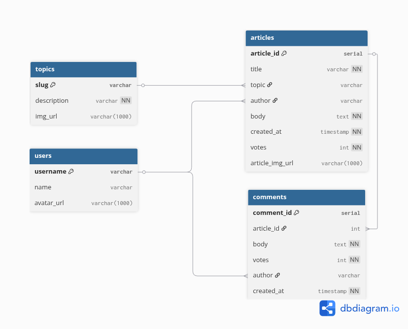

# Getting Started

## Prerequisites

[Node.js](https://nodejs.org/en/download)  
[PostgreSQL](https://www.postgresql.org/download/)

## npm packages

To install the npm dependencies run

```
npm install
```

## .env files

To be able to connect to the databases create the following files in the root directory of the repository:

.env.development  
with contents

```
PGDATABASE=nc_news
```

.env.test  
with contents

```
PGDATABASE=nc_news_test
```

If you cannot connect to the databases with the above .env files, add the following to each:

```
PGUSER=<username>
PGPASSWORD=<password>
PGHOST=localhost
PGPORT=5432
```

note: your username and password need to match the .pgpass file made when setting up psql

## Usage

To initialise the databases:

```
npm run setup-dbs
```

To seed the test database:

```
npm run test-seed
```

To seed the dev database:

```
npm run seed-dev
```

## Database Schema



_(generated from: [dbdiagram.io](https://diagram.io))_
